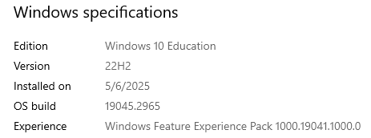

# processInjection
PoC of process injection for Linux &amp; Windows

## Payload creation
>⚠️ You need to create your own payload and add it inside the .c files as the payload variable.

To create the payload you can use msfvenom: `msfvenom -p linux/x64/exec -f c`

## Injectors
**Usage** `./<binary_name> <pid>`\
    pid (int): Targeted process id

## Process creation
**Usage** `./<binary_name>`\
    Little script to have a process to inject

## My specifications

